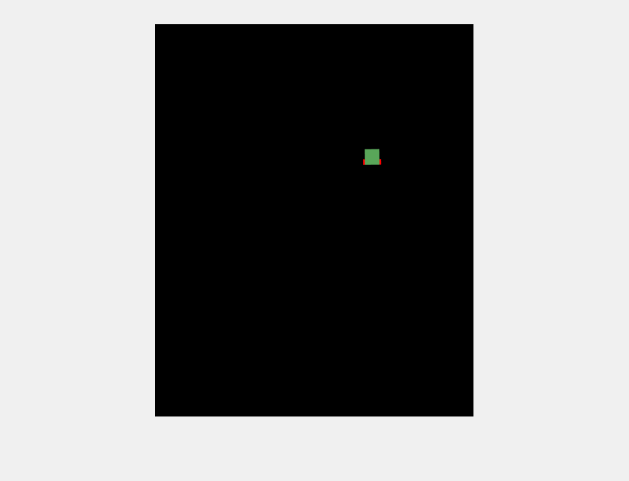

# Occupancy grid mapping in MATLAB2018a

Test-case of occupancy grid mapping using real pose data, and laser measurements.



### Getting Started

For a showcase you can copy the whole rep and run the script
```
occupancy_grid_mapping.m
```
The script will run by using the measurement file ```laser_0.log``` which includes laser sensor data as well as odometry data.

## Description

Odometry pose data is treated as the real pose of the robot, in that sense there is no variance/uncertainty in the pose data, hence the robot belief distribution at every step is  represented by a dirac centered at the robots pose. This assumption should make sense, since we are addressing exclusively a mapping problem which requires good knowledge or the robots position to create an accurate map. By relaxing this requirement, the problem gets transformed into a SLAM problem, which is beyond the scope of this example. Another assumption is that the environment is static, thus it can get only more certain(brighter), and not more uncertain(darker) that in the initialisation.

### What is occupancy grid mapping

Occupancy grid mapping is a probabilistic representation of an environment. The environment is discretised into (here even) cells and the grid values represent obstacle uncertainty. In the example above, the darker the grid the more uncertain the representation. As the robot moves around getting laser range measurements, it "sheds light" into the map and brightens the free-space areas. This is done by ray-casting the measurements on the grid and decreasing the associated cell's probability. This is a rough explanation omitting mathematical details. For a  detailed and mathematically involved explanation please refer to [a very nice book](http://www.probabilistic-robotics.org)
